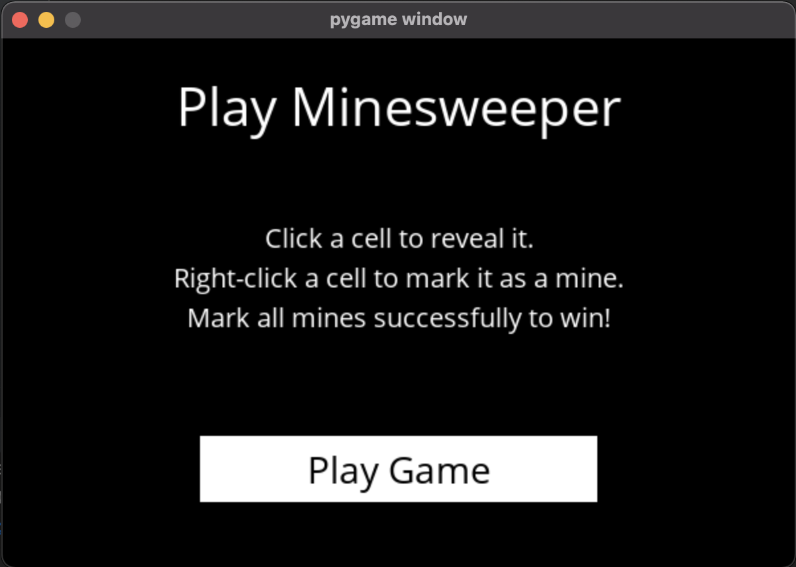
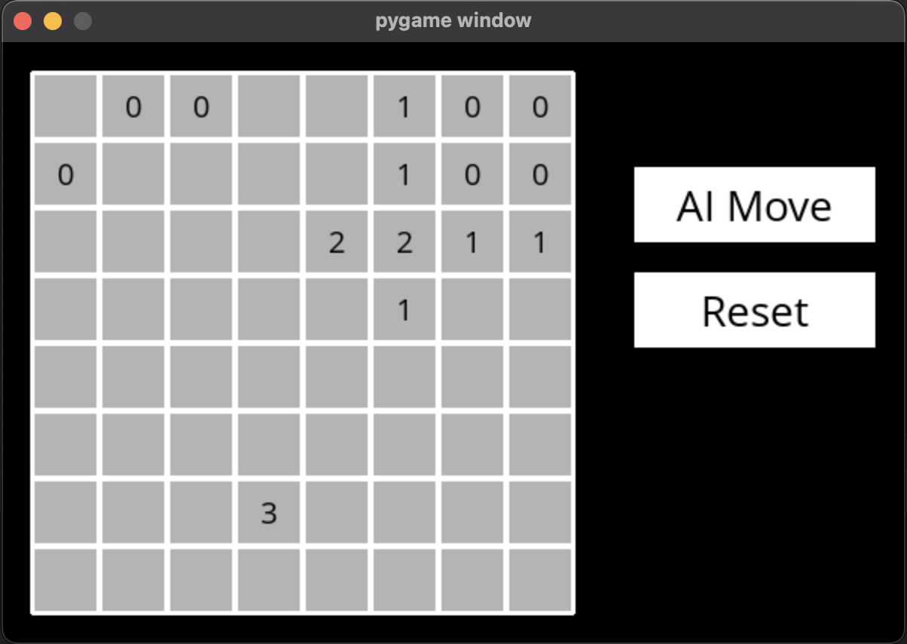
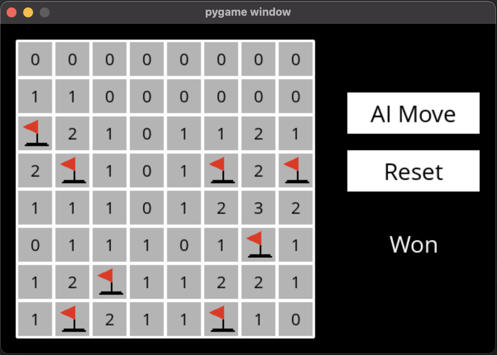
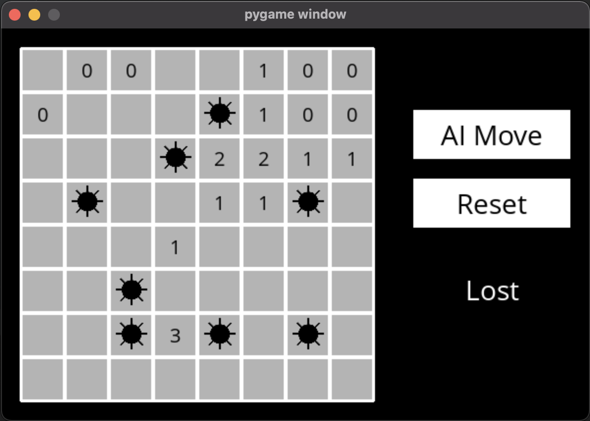

# Minesweeper-AI
Knowledge Based AI model. Tries best to avoid the mines on the minesweeper land.

How to play Minesweeper still remains an unknown land for many people. They don't know how to play it. This AI while allowing them to make manual moves can easily help them in giving hints. Thus teaching them how to play it.

***Before Starting***

## Download Dependencies
```python
pip install -r requirements.txt
```

## To run the game
```python
python3 runner.py
```

*****

## Demo Current UI

**Welcome Page**



**Middle Game**



**Win Game**



**Lost Game**



*****

## References

[Lucky Toilet](https://luckytoilet.wordpress.com/2012/12/23/2125/)